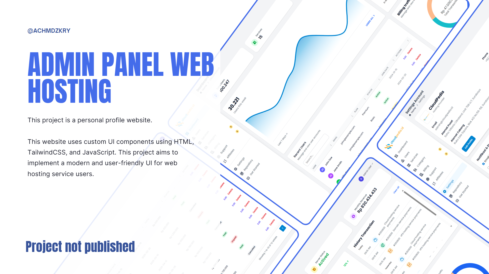

# 🌐 Admin Panel Web Hosting Sederhana

Tampilan custom UI **Admin Panel Web Hosting** sederhana berbasis **HTML murni**, **TailwindCSS**, dan **JavaScript vanilla**.

---

## 📌 Fitur/Komponen UI

- 📊 **Dashboard** (statistik ringkas)
- 📂 **Sidebar Navigasi**
- 🔝 **Header/Topbar** dengan dropdown user
- 📋 **DataTable** (list pengguna & layanan)
- 📝 **Halaman Konten** (Users, Services, Billing, dll)
- ⚙️ **Settings & Logout** (dropdown user menu)
- 📑 **Footer**

---

## 📂 Struktur Folder

```bash
admin-panel-web-host/
|
|-- node_modules               # Dependency TailwindCSS
|-- src/
│   |-- img/                   # Gambar/logo/preview
│   |-- css/
│   │   |-- input.css          # File sumber Tailwind
│   │   |-- output.css         # Hasil compile Tailwind
│   |-- js/
│   │   |-- main.js            # Script interaksi UI
|-- index.html                 # Dashboard utama
|-- users.html                 # Halaman data pengguna
|-- services.html              # Halaman layanan hosting
|-- category.html              # Halaman kategori
|-- billing.html               # Halaman tagihan
|-- supports.html              # Halaman support/tiket
|-- affiliate.html             # Halaman afiliasi
|-- setting.html               # Halaman pengaturan
|-- package-lock.json          # Konfigurasi npm
|-- package.json               # Dependency lock
|-- README.md                  # Dokumentasi
```

---

## ⚙️ Instalasi & Setup

1. **Clone repository** atau download source code:

   ```bash
   git clone https://github.com/Aryaaazrr/admin-panel-web-host.git
   cd admin-panel-web-host
   ```

2. **Install dependency TailwindCSS** (opsional, jika ingin compile ulang CSS):

   ```bash
   npm install
   npx tailwindcss -i ./src/css/input.css -o ./src/css/output.css --watch
   ```

3. **Jalankan di browser** dengan cara:
   - Open file `index.html` langsung di browser, atau
   - Gunakan ekstensi **Live Server** di VSCode

---

## 🚀 Cara Penggunaan

1. Buka `index.html` untuk melihat dashboard utama.
2. Navigasikan melalui sidebar ke halaman lain (`users.html`, `services.html`, dll).
3. Klik avatar di **header/topbar** untuk membuka menu **Settings** & **Logout**.
4. Modifikasi konten sesuai kebutuhan proyek Anda.

---

## 🛠️ Teknologi

- **Frontend:** HTML, TailwindCSS, JavaScript (vanilla)
- **Tools:** Node.js, npm, Live Server

---

## 📄 Lisensi

Proyek ini bersifat **open-source**.  
Silakan digunakan, dimodifikasi, dan dikembangkan sesuai kebutuhan.

---

✦ Dibuat dengan 💻 dan ☕ oleh [Aryaaazrr](https://github.com/Aryaaazrr)
